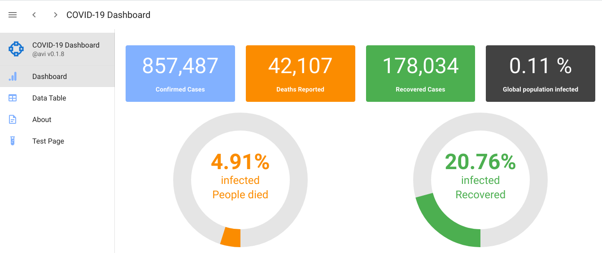
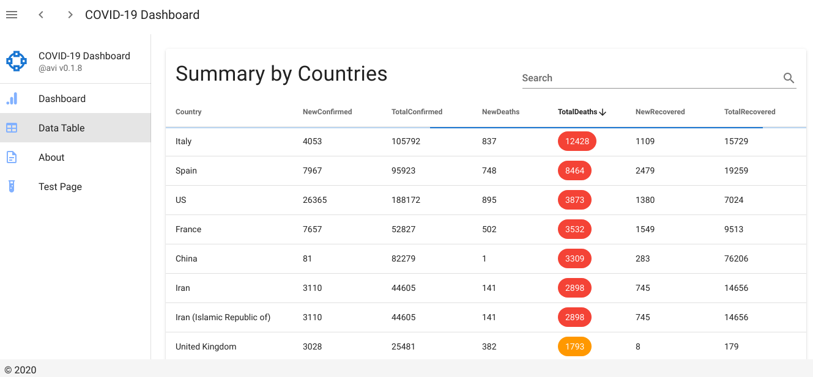

[](https://app.netlify.com/sites/clever-raman-f3dd02/deploys)
[](https://github.com/semantic-release/semantic-release)
[![badge1][badge1-img]][link1]

[badge1-img]: https://img.shields.io/badge/avi-mehenwal-orange
[link1]: https://github.com/avimehenwal

# :open_file_folder: Covid Visualization

> Visualization of covid cases from john hopkins dataset

## :tv: Demo

## :octocat: [Project Live Link](https://covid-visualization.netlify.app/)



#### :earth_asia: Breakdown by countries



---


## :wrench: How to run?

```
yarn
yarn dev
```

## :pushpin: ToDos

1. [ ] Use state management pattern
2. [ ] API Polling interval
3. [ ] Loading graphic management
4. [ ] Incremental number animation
5. [ ] Suggest search
6. [ ] backup data in `.json` file


## :sparkles: Animations

* Number animation
  * https://vuejsexamples.com/a-simple-vue-animated-number-for-vue2/


## :cyclone: References

* https://github.com/sorxrob/2019-ncov-frontend
* https://github.com/CSSEGISandData/COVID-19/issues/576
* https://github.com/github/covid19-dashboard
* https://extranet.who.int/publicemergency
* https://chschoenenberger.shinyapps.io/covid19_dashboard/
* https://www.worldometers.info/population/


## :date: [Changelog][changelog]

## :beetle: [Open Issues][issue]

## :herb: License

MIT

[url]: https://covid-visualization.netlify.app/
[issue]: https://github.com/avimehenwal/covid-visualization/issues
[changelog]: ./CHANGELOG.md

## :paperclip: Other Information

---


#### :v: Get in touch with me

> I am looking for Jobs ... :sunglasses:

* [Github](https://github.com/avimehenwal/)
* [My Website](https://avimehenwal.in)
* [My Blog v2](https://avimehenwal2.netlify.app/)
* [Twitter Handle](https://twitter.com/avimehenwal)
* [LinkedIn](https://in.linkedin.com/in/avimehenwal)
* [Stackoverflow](https://stackoverflow.com/users/1915935/avi-mehenwal)

<a href="https://www.buymeacoffee.com/F1j07cV" target="_blank"></a>

 Spread Love :hearts: and not :no_entry_sign: hatred   [](https://twitter.com/avimehenwal)